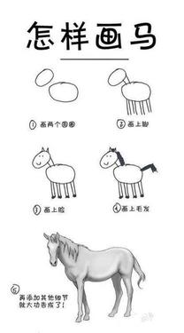
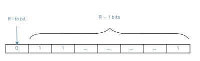

# Cardinality Estimation 算法揭秘（1）： Flajolet–Martin

## Background
---
在当今，机器学习/神经网络算法横行于世，恐怕没有多少人熟知 Cardinality Estimation 算法。但一提到大数据处理中的常见的近似估算，大家就会立马想到 HyperLogLog。没错，HyperLogLog 是现在最为成熟流行的 Cardinality Estimation 族算法之一，且在 MapReduce/Spark/ElasticSearch/Druid 等大数据技术中得到广泛的应用。为了大家能够熟(mian)练(shi)掌(zhuang)握(bi), 我们今天就来扒一扒 Cardinality Estimation。

首先，什么是 Cardinality estimation 呢？ 一位普林斯顿大学教授给出了这样的定义：

> Cardinality estimation is a fundamental problem with many applications where memory is limited. About how many different values appear in a given stream?

定义一个多元素集合的基数（Cardinality）为该集合去重之后的元素个数。那么Cardinality estimation 旨在解决内存有限的情况下如何估算得到一个集合的基数。

在计算机普世的初期，内存空间都很小，往往都以 KB, MB 计算。传统的 HashTable 类算法计算 countDistinct 时需要将所有数据都加载进内存，并且空间和时间的开销都随数据大小成线性增长。到了上世纪90年代初，就有学者发明了基于 BitMap 的近似估算算法 LinearCounting（在这个系列的后面我会详细描述这个算法，这里不做赘述）。

即便采用 BitMap 近似去重，空间开销减小，但是空间复杂度仍然是线性。在海量数据下内存开销仍然是一个不可轻视的问题，而且这类算法精确度严重依赖哈希函数和 BitMap 的空间大小。当时 Cardinality estamation 问题成了数据科学家们心中永远的痛。

这样一个恼人无解的问题，却在一位名叫 Philippe Flajolet 学者眼里被当成了无尽乐趣。这位学者于1985年和其合作学者发表了一篇论文：Probabitistic Counting Algorithms
for DataBase Applications，文中提到的 Flajolet–Martin 算法，开创 Cardinality Estamation 族算法以来  空间复杂度的先河。下面我们开始介绍这一师祖级重量的算法。

## Flajolet-Martin
---
### Algorithm
定义如下前提：

* 定义哈希函数 hash(x) 将输入 x 映射到  空间中，保证输出值 y 充分均匀地分布；
* 对于任意非负整数 y，定义 bit(y, k) 表示 y 二进制表示中的第 k 位 bit, 那么 ；
* 定义函数  为从 y 右侧开始第一个 1-bit 所在的位置， 。例如 , 。我们假定  。

Flajolet-Martin 算法给出如下步骤：

1. 将长度为 L 的 BITMAP 初始化为全0
2. 对于原始输入集合 M 中任意元素 x:
  1. 计算 index 
  2. 填充 BITMAP，
3. 取 BITMAP 右侧开始第一个 0-bit 的位置为 R， 
4. 估算集合 M 的基数为  ,  。

步骤 (1), (2), (3) 很简单对吧，步骤 (4) 怎么就得出  的结论呢？相信大家的感受如下图所示。

别着急，且听我娓娓道来。

根据 的定义， 意味着 y 的二进制表示为 。前面提到哈希函数  在空间  中符合均匀分布。假定 y 中的每一个 bit 的取值互为独立事件，那么 。易得

根据步骤 (2)，对于任意 y 使得 BITMAP[i] 被置为1的概率为。BITMAP 中的 bit 越往后，被命中的概率越小，而且以指数级下降。

在步骤 (3) 中, BITMAP 满足第 R 位 为 0-bit，其余 R - 1 个 1-bit，如下图所示。

接下来我们需要一些定义来帮助理解步骤 (4)：
* 定义事件  为 BITMAP 中插入了 n 个不同元素。

* 定义事件  为 在 n 个不同元素插入 BITMAP 后， BITMAP[i] 被设置为1，事件  为BITMAP[i]不被置为1。

* 定义操作 ，表示事件  和  同时都发生。

当事件  发生时，BITMAP 的分布则是一堆事件的集合  。集合  则满足这样一个特性 ， 即上图中的序列。

那么步骤 (4) 的问题就转化成： 对于 n 和 R，是否存在这样一种关系  使得当发生事件  时， 必然发生，即  恒成立。

在论文里，Philippe Flajolet 老爷子足足写了20页的公式才求证得到这个关系 。我奉上论文地址：[Probabilistic counting algorithms for data base applications](http://algo.inria.fr/flajolet/Publications/FlMa85.pdf)，供各位算法爱好者和数学狂热徒们研究。

### Why space-consumption logarithmic？

Flajolet–Martin 算法中，R 的最大值是 BITMAP 的长度 L，根据关系公式得出  。

所以一个基数为 n 的集合 M，只需要  空间的BITMAP就足以完成近似估算。

### Improving accuracy
Flajolet–Martin 算法受数据和哈希函数的影响，结果波动比较显著。下面列出了几个优化方案：
* 使用多个不同的 hash function 求解，并取其结果的算术平均数;
* 使用中位数代替算术平均数；
* 结合中位数和算术平均数： 创建 k * l 个 hash function，并均等地分成 k 个 group。在每个 group 中采用中位数求均值，group 之间采用算术平均数求均值。

## About author
Philippe Flajolet (French: [flaʒɔlɛ]）生于法国里昂，就读于巴黎综合理工学院，并在巴黎第十一大学获得了PhD。之后长期就职于 INRIA 和 IBM，专注研究计算复杂性理论。

1994年后，受聘于 French Academy of Sciences 和 Academia Europaea 。

2003年，发表了 Loglog Counting of Large Cardinalities，更是带领 Cardinality Estimation 算法走进了  的时代。

Philippe Flajolet 一生发表过190余篇文章。其中 Flajolet–Martin 算法更是被引用达1038次之多。这是一个怎样的概念呢？<< Nature >> 曾发布过统计，如果把全球范围内所有学科的论文叠起来，高度堪比一座近6千米高的山峰；而被引用次数超过1000次的文章仅为1.5m的山顶。

顺便一提，2014年四月 Redis 官方推出新的数据结构 HyperLogLog。其中相关的 Redis 操作命令都以 PF 为前缀，用以纪念这位伟大的科学家 Philippe Flajolet。
 

## Reference

1. [https://en.wikipedia.org/wiki/Flajolet%E2%80%93Martin_algorithm](https://en.wikipedia.org/wiki/Flajolet%E2%80%93Martin_algorithm)
2. Flajolet, Philippe; Martin, G. Nigel (1985). "[Probabilistic counting algorithms for data base applications](http://algo.inria.fr/flajolet/Publications/FlMa85.pdf)" (PDF). Journal of Computer and System Sciences. 31 (2): 182–209. doi:10.1016/0022-0000(85)90041-8
3. https://en.wikipedia.org/wiki/Philippe_Flajolet
