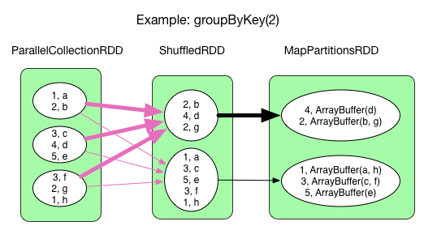
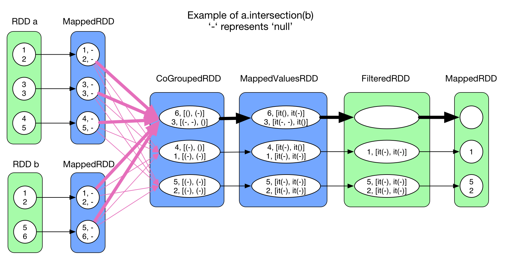
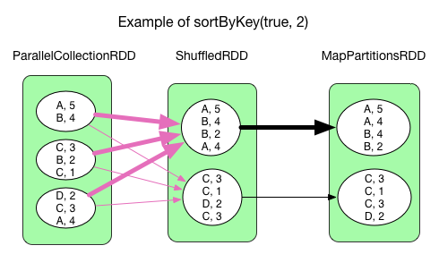
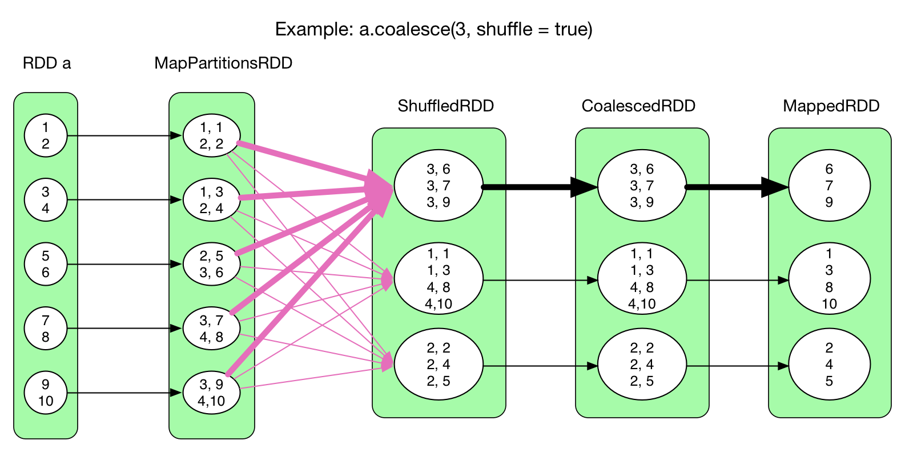
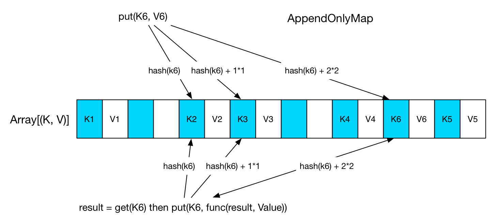
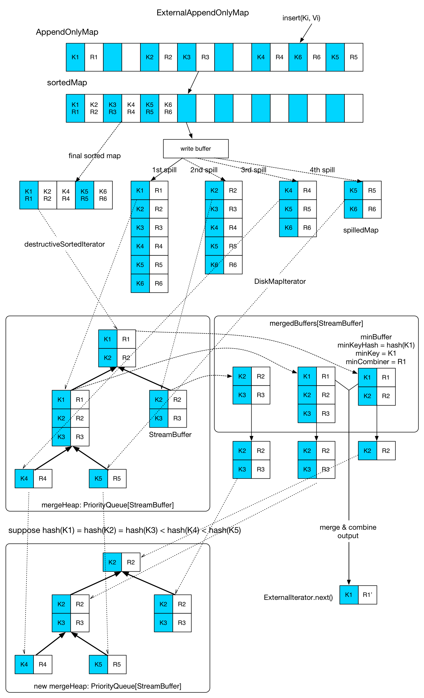

# Shuffle 过程
<!-- TOC depthFrom:1 depthTo:6 withLinks:1 updateOnSave:1 orderedList:0 -->

- [Shuffle 过程](#shuffle-过程)
	- [Spark 的 Shuffle 过程](#spark-的-shuffle-过程)
	- [Shuffle write](#shuffle-write)
	- [Shuffle read](#shuffle-read)
	- [典型 transformation() 的 shuffle read](#典型-transformation-的-shuffle-read)
		- [1. reduceByKey(func)](#1-reducebykeyfunc)
		- [2. groupByKey(numPartitions)](#2-groupbykeynumpartitions)
		- [3. distinct(numPartitions)](#3-distinctnumpartitions)
		- [4. cogroup(otherRDD, numPartitions)](#4-cogroupotherrdd-numpartitions)
		- [5. intersection(otherRDD) 和 join(otherRDD, numPartitions)](#5-intersectionotherrdd-和-joinotherrdd-numpartitions)
		- [6. sortByKey(ascending, numPartitions)](#6-sortbykeyascending-numpartitions)
		- [7. coalesce(numPartitions, shuffle = true)](#7-coalescenumpartitions-shuffle-true)
	- [Shuffle read 中的 HashMap](#shuffle-read-中的-hashmap)
		- [1. AppendOnlyMap](#1-appendonlymap)
		- [2. ExternalAppendOnlyMap](#2-externalappendonlymap)

<!-- /TOC -->
## Spark 的 Shuffle 过程
---
如果熟悉 Hadoop MapReduce 中的 shuffle 过程，可能会按照 MapReduce 的思路去想象 Spark 的 shuffle 过程。然而，它们之间有一些区别和联系。

**从 high-level 的角度来看，两者并没有大的差别。** 都是将 mapper（Spark 里是 ShuffleMapTask）的输出进行 partition，不同的 partition 送到不同的 reducer（Spark 里 reducer 可能是下一个 stage 里的 ShuffleMapTask，也可能是 ResultTask）。Reducer 以内存作缓冲区，边 shuffle 边 aggregate 数据，等到数据 aggregate 好以后进行 reduce() （Spark 里可能是后续的一系列操作）。

**从 low-level 的角度来看，两者差别不小。** Hadoop MapReduce 是 sort-based，进入 combine() 和 reduce() 的 records 必须先 sort。这样的好处在于 combine/reduce() 可以处理大规模的数据，因为其输入数据可以通过外排得到（mapper 对每段数据先做排序，reducer 的 shuffle 对排好序的每段数据做归并）。目前的 Spark 默认选择的是 hash-based，通常使用 HashMap 来对 shuffle 来的数据进行 aggregate，不会对数据进行提前排序。如果用户需要经过排序的数据，那么需要自己调用类似 sortByKey() 的操作；如果你是Spark 1.1的用户，可以将spark.shuffle.manager设置为sort，则会对数据进行排序。在Spark 1.2中，sort将作为默认的Shuffle实现。

**从实现角度来看，两者也有不少差别。** Hadoop MapReduce 将处理流程划分出明显的几个阶段：map(), spill, merge, shuffle, sort, reduce() 等。每个阶段各司其职，可以按照过程式的编程思想来逐一实现每个阶段的功能。在 Spark 中，没有这样功能明确的阶段，只有不同的 stage 和一系列的 transformation()，所以 spill, merge, aggregate 等操作需要蕴含在 transformation() 中。

如果我们将 map 端划分数据、持久化数据的过程称为 shuffle write，而将 reducer 读入数据、aggregate 数据的过程称为 shuffle read。那么在 Spark 中，**问题就变为怎么在 job 的逻辑或者物理执行图中加入 shuffle write 和 shuffle read 的处理逻辑？以及两个处理逻辑应该怎么高效实现？**

## Shuffle write
---
由于不要求数据有序，shuffle write 的任务很简单：将数据 partition 好，并持久化。之所以要持久化，一方面是要减少内存存储空间压力，另一方面也是为了 fault-tolerance。

shuffle write 的任务很简单，那么实现也很简单：将 shuffle write 的处理逻辑加入到 ShuffleMapStage（ShuffleMapTask 所在的 stage） 的最后，该 stage 的 final RDD 每输出一个 record 就将其 partition 并持久化。图示如下：


上图有 4 个 ShuffleMapTask 要在同一个 worker node 上运行，CPU core 数为 2，可以同时运行两个 task。每个 task 的执行结果（该 stage 的 finalRDD 中某个 partition 包含的 records）被逐一写到本地磁盘上。每个 task 包含 R 个缓冲区，R = reducer 个数（也就是下一个 stage 中 task 的个数），缓冲区被称为 bucket，其大小为spark.shuffle.file.buffer.kb ，默认是 32KB（Spark 1.1 版本以前是 100KB）。

> 其实 bucket 是一个广义的概念，代表 ShuffleMapTask 输出结果经过 partition 后要存放的地方，这里为了细化数据存放位置和数据名称，仅仅用 bucket 表示缓冲区。

ShuffleMapTask 的执行过程很简单：先利用 pipeline 计算得到 finalRDD 中对应 partition 的 records。每得到一个 record 就将其送到对应的 bucket 里，具体是哪个 bucket 由partitioner.partition(record.getKey()))决定。每个 bucket 里面的数据会不断被写到本地磁盘上，形成一个 ShuffleBlockFile，或者简称 **FileSegment**。之后的 reducer 会去 fetch 属于自己的 FileSegment，进入 shuffle read 阶段。

这样的实现很简单，但有几个问题：

1. **产生的 FileSegment 过多。**每个 ShuffleMapTask 产生 R（reducer 个数）个 FileSegment，M 个 ShuffleMapTask 就会产生 M * R 个文件。一般 Spark job 的 M 和 R 都很大，因此磁盘上会存在大量的数据文件。
2. **缓冲区占用内存空间大。**每个 ShuffleMapTask 需要开 R 个 bucket，M 个 ShuffleMapTask 就会产生 M_R 个 bucket。虽然一个 ShuffleMapTask 结束后，对应的缓冲区可以被回收，但一个 worker node 上同时存在的 bucket 个数可以达到 cores _R 个（一般 worker 同时可以运行 cores 个 ShuffleMapTask），占用的内存空间也就达到了cores * R * 32 KB。对于 8 核 1000 个 reducer 来说，占用内存就是 256MB。
目前来看，第二个问题还没有好的方法解决，因为写磁盘终究是要开缓冲区的，缓冲区太小会影响 IO 速度。但第一个问题有一些方法去解决，下面介绍已经在 Spark 里面实现的 FileConsolidation 方法。先上图：


可以明显看出，在一个 core 上连续执行的 ShuffleMapTasks 可以共用一个输出文件 ShuffleFile。先执行完的 ShuffleMapTask 形成 ShuffleBlock i，后执行的 ShuffleMapTask 可以将输出数据直接追加到 ShuffleBlock i 后面，形成 ShuffleBlock i'，每个 ShuffleBlock 被称为 FileSegment。下一个 stage 的 reducer 只需要 fetch 整个 ShuffleFile 就行了。这样，每个 worker 持有的文件数降为 cores * R。FileConsolidation 功能可以通过spark.shuffle.consolidateFiles=true来开启。

## Shuffle read
---
先看一张包含 ShuffleDependency 的物理执行图，来自 reduceByKey：


很自然地，要计算 ShuffleRDD 中的数据，必须先把 MapPartitionsRDD 中的数据 fetch 过来。那么问题就来了：

* 在什么时候 fetch，parent stage 中的一个 ShuffleMapTask 执行完还是等全部 ShuffleMapTasks 执行完？
* 边 fetch 边处理还是一次性 fetch 完再处理？
* fetch 来的数据存放到哪里？
* 怎么获得要 fetch 的数据的存放位置？

解决问题：

* **在什么时候 fetch？**当 parent stage 的所有 ShuffleMapTasks 结束后再 fetch。理论上讲，一个 ShuffleMapTask 结束后就可以 fetch，但是为了迎合 stage 的概念（即一个 stage 如果其 parent stages 没有执行完，自己是不能被提交执行的），还是选择全部 ShuffleMapTasks 执行完再去 fetch。因为 fetch 来的 FileSegments 要先在内存做缓冲，所以一次 fetch 的 FileSegments 总大小不能太大。Spark 规定这个缓冲界限不能超过 spark.reducer.maxMbInFlight，这里用 softBuffer 表示，默认大小为 48MB。一个 softBuffer 里面一般包含多个 FileSegment，但如果某个 FileSegment 特别大的话，这一个就可以填满甚至超过 softBuffer 的界限。

* **边 fetch 边处理还是一次性 fetch 完再处理？**边 fetch 边处理。本质上，MapReduce shuffle 阶段就是边 fetch 边使用 combine() 进行处理，只是 combine() 处理的是部分数据。MapReduce 为了让进入 reduce() 的 records 有序，必须等到全部数据都 shuffle-sort 后再开始 reduce()。因为 Spark 不要求 shuffle 后的数据全局有序，因此没必要等到全部数据 shuffle 完成后再处理。**那么如何实现边 shuffle 边处理，而且流入的 records 是无序的？**答案是使用可以 aggregate 的数据结构，比如 HashMap。每 shuffle 得到（从缓冲的 FileSegment 中 deserialize 出来）一个 \ record，直接将其放进 HashMap 里面。如果该 HashMap 已经存在相应的 Key，那么直接进行 aggregate 也就是 func(hashMap.get(Key), Value)，比如上面 WordCount 例子中的 func 就是 hashMap.get(Key) ＋ Value，并将 func 的结果重新 put(key) 到 HashMap 中去。这个 func 功能上相当于 reduce()，但实际处理数据的方式与 MapReduce reduce() 有差别，差别相当于下面两段程序的差别。

  ```
  // MapReduce
   reduce(K key, Iterable<V> values) {
       result = process(key, values)
       return result
   }

   // Spark
   reduce(K key, Iterable<V> values) {
       result = null
       for (V value : values)
           result  = func(result, value)
       return result
   }
   ```

MapReduce 可以在 process 函数里面可以定义任何数据结构，也可以将部分或全部的 values 都 cache 后再进行处理，非常灵活。而 Spark 中的 func 的输入参数是固定的，一个是上一个 record 的处理结果，另一个是当前读入的 record，它们经过 func 处理后的结果被下一个 record 处理时使用。因此一些算法比如求平均数，在 process 里面很好实现，直接sum(values)/values.length，而在 Spark 中 func 可以实现sum(values)，但不好实现/values.length。更多的 func 将会在下面的章节细致分析。

* **fetch 来的数据存放到哪里？**刚 fetch 来的 FileSegment 存放在 softBuffer 缓冲区，经过处理后的数据放在内存 + 磁盘上。这里我们主要讨论处理后的数据，可以灵活设置这些数据是“只用内存”还是“内存＋磁盘”。如果spark.shuffle.spill = false就只用内存。内存使用的是AppendOnlyMap ，类似 Java 的HashMap，内存＋磁盘使用的是ExternalAppendOnlyMap，如果内存空间不足时，ExternalAppendOnlyMap可以将 \ records 进行 sort 后 spill 到磁盘上，等到需要它们的时候再进行归并，后面会详解。**使用“内存＋磁盘”的一个主要问题就是如何在两者之间取得平衡？**在 Hadoop MapReduce 中，默认将 reducer 的 70% 的内存空间用于存放 shuffle 来的数据，等到这个空间利用率达到 66% 的时候就开始 merge-combine()-spill。在 Spark 中，也适用同样的策略，一旦 ExternalAppendOnlyMap 达到一个阈值就开始 spill，具体细节下面会讨论。

* **怎么获得要 fetch 的数据的存放位置？**在上一章讨论物理执行图中的 stage 划分的时候，我们强调 “一个 ShuffleMapStage 形成后，会将该 stage 最后一个 final RDD 注册到MapOutputTrackerMaster.registerShuffle(shuffleId, rdd.partitions.size)，这一步很重要，因为 shuffle 过程需要 MapOutputTrackerMaster 来指示 ShuffleMapTask 输出数据的位置”。因此，reducer 在 shuffle 的时候是要去 driver 里面的 MapOutputTrackerMaster 询问 ShuffleMapTask 输出的数据位置的。每个 ShuffleMapTask 完成时会将 FileSegment 的存储位置信息汇报给 MapOutputTrackerMaster。

## 典型 transformation() 的 shuffle read
---
### 1. reduceByKey(func)
上面初步介绍了 reduceByKey() 是如何实现边 fetch 边 reduce() 的。需要注意的是虽然 Example(WordCount) 中给出了各个 RDD 的内容，但一个 partition 里面的 records 并不是同时存在的。比如在 ShuffledRDD 中，每 fetch 来一个 record 就立即进入了 func 进行处理。MapPartitionsRDD 中的数据是 func 在全部 records 上的处理结果。从 record 粒度上来看，reduce() 可以表示如下：


可以看到，fetch 来的 records 被逐个 aggreagte 到 HashMap 中，等到所有 records 都进入 HashMap，就得到最后的处理结果。唯一要求是 func 必须是 commulative 的（参见上面的 Spark 的 reduce() 的代码）。

ShuffledRDD 到 MapPartitionsRDD 使用的是 mapPartitionsWithContext 操作。

为了减少数据传输量，MapReduce 可以在 map 端先进行 combine()，其实在 Spark 也可以实现，只需要将上图 ShuffledRDD => MapPartitionsRDD 的 mapPartitionsWithContext 在 ShuffleMapStage 中也进行一次即可，比如 reduceByKey 例子中 ParallelCollectionRDD => MapPartitionsRDD 完成的就是 map 端的 combine()。

**对比 MapReduce 的 map()-reduce() 和 Spark 中的 reduceByKey()：**

* map 端的区别：map() 没有区别。对于 combine()，MapReduce 先 sort 再 combine()，Spark 直接在 HashMap 上进行 combine()。
* reduce 端区别：MapReduce 的 shuffle 阶段先 fetch 数据，数据量到达一定规模后 combine()，再将剩余数据 merge-sort 后 reduce()，reduce() 非常灵活。Spark 边 fetch 边 reduce()（在 HashMap 上执行 func），因此要求 func 符合 commulative 的特性。

**从内存利用上来对比：**

* map 端区别：MapReduce 需要开一个大型环形缓冲区来暂存和排序 map() 的部分输出结果，但 combine() 不需要额外空间（除非用户自己定义）。 Spark 需要 HashMap 内存数据结构来进行 combine()，同时输出 records 到磁盘上时也需要一个小的 buffer（bucket）。
* reduce 端区别：MapReduce 需要一部分内存空间来存储 shuffle 过来的数据，combine() 和 reduce() 不需要额外空间，因为它们的输入数据分段有序，只需归并一下就可以得到。在 Spark 中，fetch 时需要 softBuffer，处理数据时如果只使用内存，那么需要 HashMap 来持有处理后的结果。如果使用内存＋磁盘，那么在 HashMap 存放一部分处理后的数据。

### 2. groupByKey(numPartitions)



与 reduceByKey() 流程一样，只是 func 变成 result = result ++ record.value，功能是将每个 key 对应的所有 values 链接在一起。result 来自 hashMap.get(record.key)，计算后的 result 会再次被 put 到 hashMap 中。与 reduceByKey() 的区别就是 groupByKey() 没有 map 端的 combine()。对于 groupByKey() 来说 map 端的 combine() 只是减少了重复 Key 占用的空间，如果 key 重复率不高，没必要 combine()，否则，最好能够 combine()。

### 3. distinct(numPartitions)


与 reduceByKey() 流程一样，只是 func 变成 result = result == null? record.value : result，如果 HashMap 中没有该 record 就将其放入，否则舍弃。与 reduceByKey() 相同，在map 端存在 combine()。

### 4. cogroup(otherRDD, numPartitions)


CoGroupedRDD 可能有 0 个、1 个或者多个 ShuffleDependency。但并不是要为每一个 ShuffleDependency 建立一个 HashMap，而是所有的 Dependency 共用一个 HashMap。与 reduceByKey() 不同的是，HashMap 在 CoGroupedRDD 的 compute() 中建立，而不是在 mapPartitionsWithContext() 中建立。

粗线表示的 task 首先 new 出一个 Array[ArrayBuffer(), ArrayBuffer()]，ArrayBuffer() 的个数与参与 cogroup 的 RDD 个数相同。func 的逻辑是这样的：每当从 RDD a 中 shuffle 过来一个 \ record 就将其添加到 hashmap.get(Key) 对应的 Array 中的第一个 ArrayBuffer() 中，每当从 RDD b 中 shuffle 过来一个 record，就将其添加到对应的 Array 中的第二个 ArrayBuffer()。

CoGroupedRDD => MappedValuesRDD 对应 mapValues() 操作，就是将 [ArrayBuffer(), ArrayBuffer()] 变成 [Iterable[V], Iterable[W]]。

### 5. intersection(otherRDD) 和 join(otherRDD, numPartitions)



这两个操作中均使用了 cogroup，所以 shuffle 的处理方式与 cogroup 一样。

### 6. sortByKey(ascending, numPartitions)



sortByKey() 中 ShuffledRDD => MapPartitionsRDD 的处理逻辑与 reduceByKey() 不太一样，没有使用 HashMap 和 func 来处理 fetch 过来的 records。

sortByKey() 中 ShuffledRDD => MapPartitionsRDD 的处理逻辑是：将 shuffle 过来的一个个 record 存放到一个 Array 里，然后按照 Key 来对 Array 中的 records 进行 sort。

### 7. coalesce(numPartitions, shuffle = true)



coalesce() 虽然有 ShuffleDependency，但不需要对 shuffle 过来的 records 进行 aggregate，所以没有建立 HashMap。每 shuffle 一个 record，就直接流向 CoalescedRDD，进而流向 MappedRDD 中。

## Shuffle read 中的 HashMap
---
HashMap 是 Spark shuffle read 过程中频繁使用的、用于 aggregate 的数据结构。Spark 设计了两种：一种是全内存的 AppendOnlyMap，另一种是内存＋磁盘的 ExternalAppendOnlyMap。下面我们来分析一下两者特性及内存使用情况。

### 1. AppendOnlyMap

AppendOnlyMap 的官方介绍是 A simple open hash table optimized for the append-only use case, where keys are never removed, but the value for each key may be changed。意思是类似 HashMap，但没有remove(key)方法。其实现原理很简单，开一个大 Object 数组，蓝色部分存储 Key，白色部分存储 Value。如下图：



当要 put(K, V) 时，先 hash(K) 找存放位置，**如果存放位置已经被占用，就使用 Quadratic probing 探测方法来找下一个空闲位置。**对于图中的 K6 来说，第三次查找找到 K4 后面的空闲位置，放进去即可。get(K6) 的时候类似，找三次找到 K6，取出紧挨着的 V6，与先来的 value 做 func，结果重新放到 V6 的位置。

迭代 AppendOnlyMap 中的元素的时候，从前到后扫描输出。

如果 Array 的利用率达到 70%，那么就扩张一倍，并对所有 key 进行 rehash 后，重新排列每个 key 的位置。

AppendOnlyMap 还有一个 destructiveSortedIterator(): Iterator[(K, V)] 方法，可以返回 Array 中排序后的 (K, V) pairs。实现方法很简单：先将所有 (K, V) pairs compact 到 Array 的前端，并使得每个 (K, V) 占一个位置（原来占两个），之后直接调用 Array.sort() 排序，不过这样做会破坏数组（key 的位置变化了）。

### 2. ExternalAppendOnlyMap



相比 AppendOnlyMap，ExternalAppendOnlyMap 的实现略复杂，但逻辑其实很简单，类似 Hadoop MapReduce 中的 shuffle-merge-combine-sort 过程：

ExternalAppendOnlyMap 持有一个 AppendOnlyMap，shuffle 来的一个个 (K, V) record 先 insert 到 AppendOnlyMap 中，insert 过程与原始的 AppendOnlyMap 一模一样。**如果 AppendOnlyMap 快被装满时检查一下内存剩余空间是否可以够扩展，够就直接在内存中扩展，不够就 sort 一下 AppendOnlyMap，将其内部所有 records 都 spill 到磁盘上。**图中 spill 了 4 次，每次 spill 完在磁盘上生成一个 spilledMap 文件，然后重新 new 出来一个 AppendOnlyMap。最后一个 (K, V) record insert 到 AppendOnlyMap 后，表示所有 shuffle 来的 records 都被放到了 ExternalAppendOnlyMap 中，但不表示 records 已经被处理完，因为每次 insert 的时候，新来的 record 只与 AppendOnlyMap 中的 records 进行 aggregate，并不是与所有的 records 进行 aggregate（一些 records 已经被 spill 到磁盘上了）。因此当需要 aggregate 的最终结果时，需要对 AppendOnlyMap 和所有的 spilledMaps 进行全局 merge-aggregate。

**全局 merge-aggregate 的流程也很简单：**先将 AppendOnlyMap 中的 records 进行 sort，形成 sortedMap。然后利用 DestructiveSortedIterator 和 DiskMapIterator 分别从 sortedMap 和各个 spilledMap 读出一部分数据（StreamBuffer）放到 mergeHeap 里面。StreamBuffer 里面包含的 records 需要具有相同的 hash(key)，所以图中第一个 spilledMap 只读出前三个 records 进入 StreamBuffer。mergeHeap 顾名思义就是使用堆排序不断提取出 hash(firstRecord.Key) 相同的 StreamBuffer，并将其一个个放入 mergeBuffers 中，放入的时候与已经存在于 mergeBuffers 中的 StreamBuffer 进行 merge-combine，第一个被放入 mergeBuffers 的 StreamBuffer 被称为 minBuffer，那么 minKey 就是 minBuffer 中第一个 record 的 key。当 merge-combine 的时候，与 minKey 相同的 records 被 aggregate 一起，然后输出。整个 merge-combine 在 mergeBuffers 中结束后，StreamBuffer 剩余的 records 随着 StreamBuffer 重新进入 mergeHeap。一旦某个 StreamBuffer 在 merge-combine 后变为空（里面的 records 都被输出了），那么会使用 DestructiveSortedIterator 或 DiskMapIterator 重新装填 hash(key) 相同的 records，然后再重新进入 mergeHeap。

整个 insert-merge-aggregate 的过程有三点需要进一步探讨一下：

* 内存剩余空间检测

  与 Hadoop MapReduce 规定 reducer 中 70% 的空间可用于 shuffle-sort 类似，Spark 也规定 executor 中 spark.shuffle.memoryFraction * spark.shuffle.safetyFraction 的空间（默认是0.3 * 0.8）可用于 ExternalOnlyAppendMap。Spark 略保守是不是？更保守的是这 24％ 的空间不是完全用于一个 ExternalOnlyAppendMap 的，而是由在 executor 上同时运行的所有 reducer 共享的。为此，exectuor 专门持有一个 ShuffleMemroyMap: HashMap[threadId, occupiedMemory] 来监控每个 reducer 中 ExternalOnlyAppendMap 占用的内存量。每当 AppendOnlyMap 要扩展时，都会计算ShuffleMemroyMap 持有的所有 reducer 中的 AppendOnlyMap 已占用的内存 ＋ 扩展后的内存 是会否会大于内存限制，大于就会将 AppendOnlyMap spill 到磁盘。有一点需要注意的是前 1000 个 records 进入 AppendOnlyMap 的时候不会启动是否要 spill 的检查，需要扩展时就直接在内存中扩展。

* AppendOnlyMap 大小估计

  为了获知 AppendOnlyMap 占用的内存空间，可以在每次扩展时都将 AppendOnlyMap reference 的所有 objects 大小都算一遍，然后加和，但这样做非常耗时。所以 Spark 设计了粗略的估算算法，算法时间复杂度是 O(1)，核心思想是利用 AppendOnlyMap 中每次 insert-aggregate record 后 result 的大小变化及一共 insert 的 records 的个数来估算大小，具体见 SizeTrackingAppendOnlyMap 和SizeEstimator。

* Spill 过程

  与 shuffle write 一样，在 spill records 到磁盘上的时候，会建立一个 buffer 缓冲区，大小仍为spark.shuffle.file.buffer.kb ，默认是 32KB。另外，由于 serializer 也会分配缓冲区用于序列化和反序列化，所以如果一次 serialize 的 records 过多的话缓冲区会变得很大。Spark 限制每次 serialize 的 records 个数为 spark.shuffle.spill.batchSize，默认是 10000。
